<h1>Measuring the frequency response of in-ear monitors</h1>

This is a comprehensive guide on measuring the frequency response of in-ear monitors yourself using a device (Smartphone, PC, etc) and an IEC711 clone coupler. 

<h3>Contents</h3>

[1. Equipment](#Equipment)

[2. Software](#REW)

[3. Taking Measurements](#Measurements)

[4. Exporting Data](#Data)

<h2><a name="Eqipment">Equipment</h2></a>

To get started, you will need the following:

 - An IEC711 coupler: https://a.aliexpress.com/_mMGFX86
 - A device capable of running REW or AudioTools such as a desktop or laptop PC, or any device running MacOS, iOS or iPadOS
 - A USB-C (or Lightning) to 3.5mm adapter to use as an ADC, amplifier and DAC for measurements, such as the revered Apple USB-C to 3.5mm Adapter: https://www.apple.com/au/shop/product/MU7E2FE/A/usb-c-to-35-mm-headphone-jack-adapter
 - A 3.5mm male to dual 3.5mm female adapter, to seperate the microphone and headphone inputs

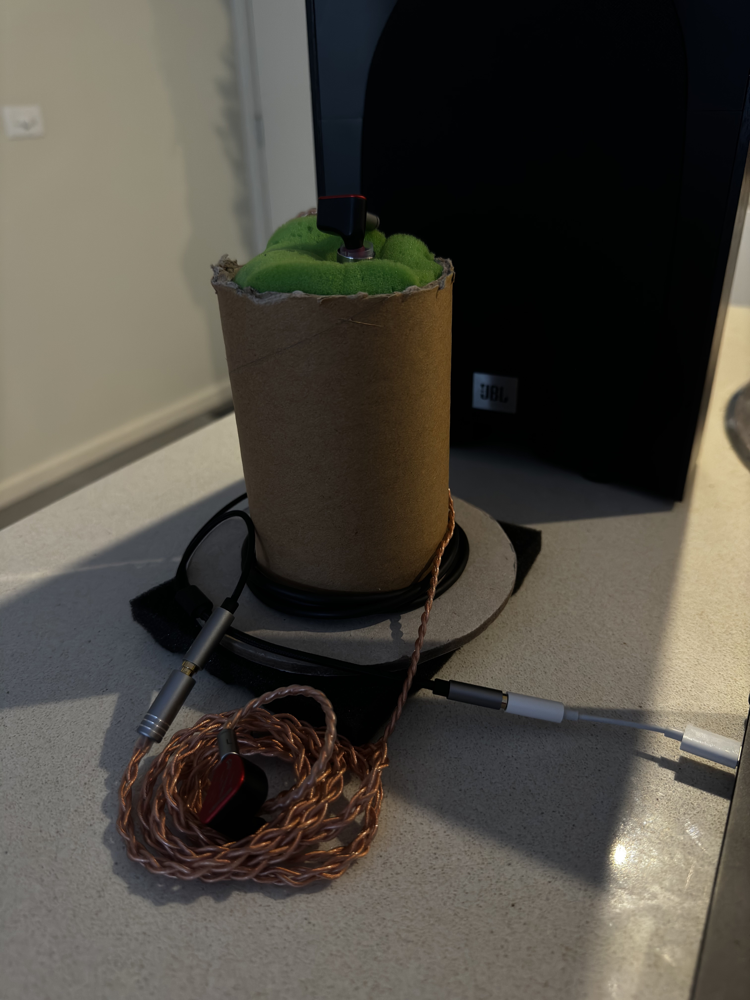

<h2><a name="Equipment">Software</h2></a>

If you are on a Windows, Mac or Linux device, use RoomEQWizard, available here: https://www.roomeqwizard.com/

If you are on a device running iOS or iPadOS, use AudioTools, available here: https://apps.apple.com/au/app/audiotools-db-sound-audio/id325307477

<h3>Configuring RoomEQWizard</h3>

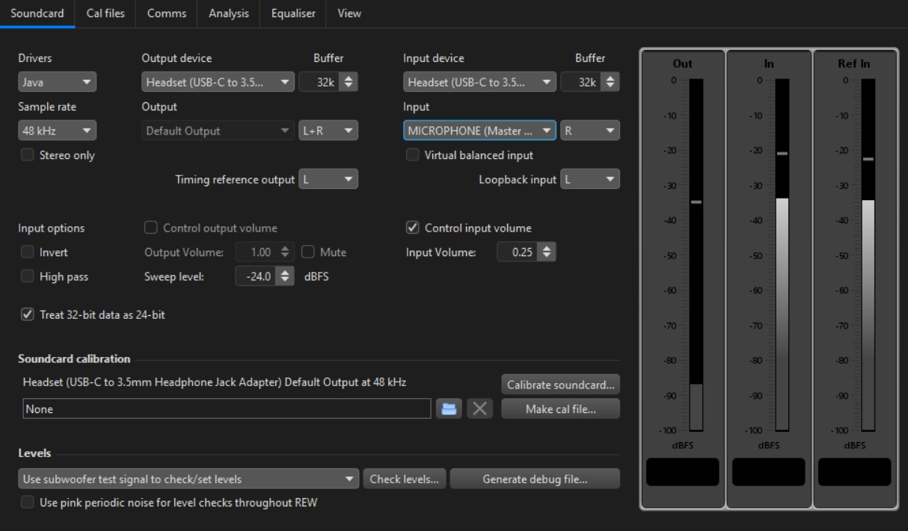 

Navivate to Preferences in REW, and assign your inputs and outputs to use the Apple USB-C to 3.5mm Adapter. Your preferences should appear as above or similar if you are using a different device.

<h3>Configuring AudioTools</h3>

The process for configuring AudioTools is more involved than REW. 

First, you want to upload a basic calibration file for use with your Adapter. Navigate to <b>Settings</b> and then <b>Microphone Setup</b>. Download [this file](Assets/Flat_Target.txt), select the adapter in the <b>Input Source</b> page and then select <b>Cal File</b>. Select the file you downloaded in the File Browser, then hit 'Apply'. Once done, make sure you set the adapter to <b>High Range</b> as it will be Low Range by default.

Next, navigate back to the home page of AudioTools, from there, select <b>Acoustics</b> and <b>FFT</b>. This is where most of our measurements will be conducted, instead of being a sweep like in REW, we will use this test to collect an average over time using Pink Noise.

Select the <b>Wrench Icon on the bottom-right hand side</b>, and change the following settings:
 - FFT Size: 32768 points
 - dB Scale: 30dB - 120dB (or adjust to preference for smaller or larger scaling)
 - Lock Graph Scale: Enabled
 - Advanced FFT Settings: Hamming
 - Overlap: 45%
 - Other Settings: Thick Plot

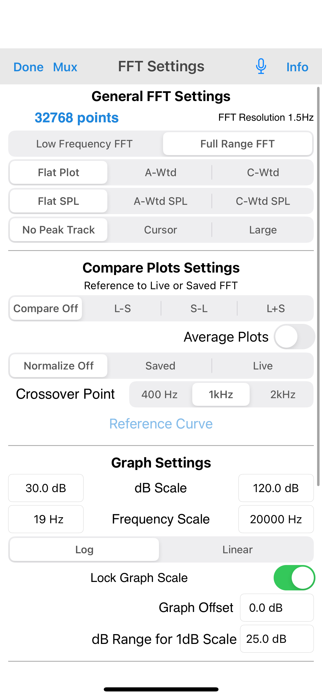
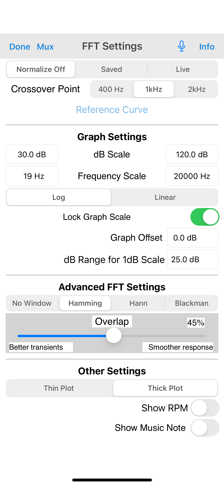

 Press on <b>"Fast" on the bottom-right hand side</b>, and change it to <b>Average</b>. Press on <b>"1/12 Octave on the bottom-left hand side</b>, and change this to <b>1/24 Octave</b>.

 <a name="Measurements"><h2>Taking Measurements</h2></a> 

 Now that you have REW or AudioTools configured, it's time to measure. I like to follow these best practices when collecting data:
  - Use included eartips, preferrably a smaller size to make insertion easier into the coupler
  - Align the 8kHz resonance (or other frequency response artificats common in this region) commonly found with IEC711 couplers between measurements, to ensure consistency (you will notice a spike around this region)
  - Use different insertion depths and document them
  - Normalize measurments to the same dB level, I prefer to use 84dB

<h3>Measuring in RoomEQWizard</h3>

Select <b>Measure</b> in the top bar on the left-hand side of REW.

Insert the IEM you wish to measure into the open end of the coupler, being sure not to push it in too deep, but keeping it just where it forms enough of a seal not to come loose.

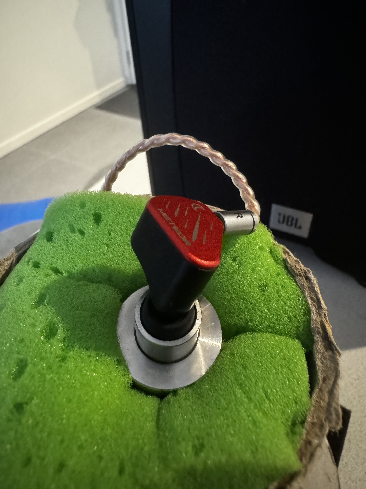

To begin with, insert the name of the IEM you're measuring into the <b>Name</b> field, as well as the channel that you're measuring. Example: <i>Example IEM R</i>

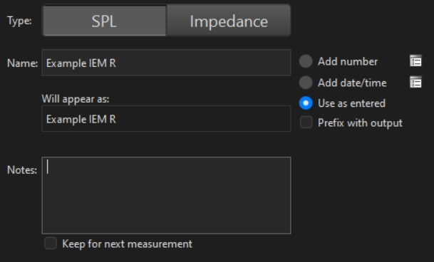

You want to establish the volume level you are going to conduct your measurement at, it is best to ensure this is the same between both channels of the IEM as well as between measurements. By pressing <b>Check Levels</b>, white noise will play at the volume level you define in the <b>Level</b> box. Ideally <b>start at -24dB</b>, then gradually bring that number higher or lower until you reach 84dB.

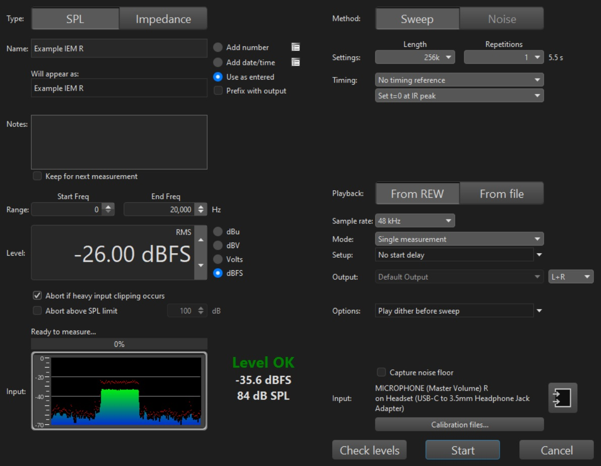

Now, it's time ot perform the sweep. Upon pressing <b>Start</b>, a sine wave will play over the course of a few seconds, and the microphone inside the coupler will record the decibel level of all the frequencies it hears, resulting in a plot that looks like the image below:

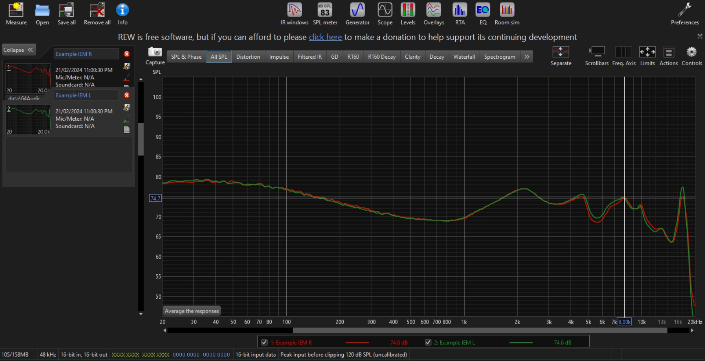
<i>Your results will appear smoother than the ones above, this data was imported from a previous measurement.</i>

Note the <b>8kHz resonance pointed out</b>, we want to try our best to align this between measurements. If you notice that the resonance peak is at a higher frequency than 8kHz, try pulling the IEM further out of the coupler, reducing the insertion depth. The opposite is true if you notice this resonance peak occurring earlier than 8kHz. <b>Note:</b> <i>This may not appear on all in-ear monitors, in some cases there may be a recess where you'd expect the peak, or some kind of other artifact.</i>

Now that you've measured one channel, repeat the same steps for the other channel. Take as much time and as many measurements as you need to establish consistency between them.

Your results will automatically appear on the left hand side of REW once complete, be sure to use the <b>X</b> icon next to each measurement to get rid of any failed attempts and narrow it down to two final results, one for the left hand side and one for the right.

Now, hit <b>File > Export > Export all measurements as text</b>. Use the following paramaters when exporting your measurements, and when done, hit <b>Save</b> to choose a location to save them to on your system.

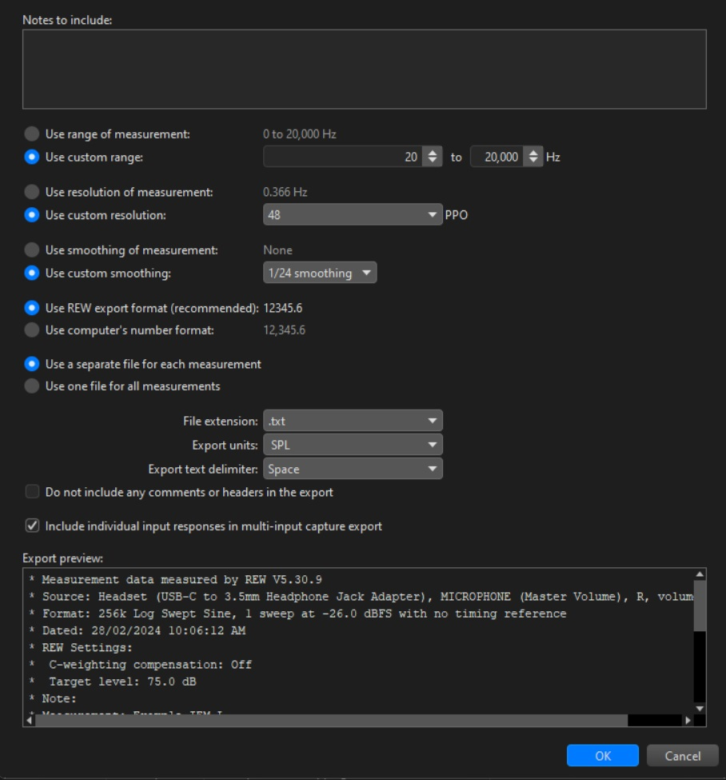

<h3>Measuring in AudioTools</h3>

In AudioTools, we will be using pink noise and collecting an average over 30s of the frequency response, being sure to normalize the level we're doing our measurements at as well as lining up the 8kHz resonance peak as we'd do when using REW.

In AudioTools' <b>FFT Test</b>, press the squiggly line on the bottom bar. This will open the Pink Noise generator. Once you toggle this on, pink noise will begin to play and the plot will record averages over however long you run this test. If you notice any abnormalities or if the IEM somehow comes loose during the test, you can hit <b>Reset</b> in the bottom right hand side to restart the plot.

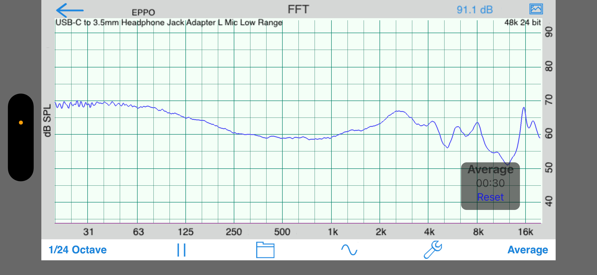

Record the average over a 30s - 1m period, or as long as it takes for any abnormalities, particularly in the bass, to level out. The end result should look like the image above, smoothed out. 

Try and match the volume level at 1kHz between measurements.

Repeat for the other channel, keeping volume at 1kHz consistent as well as keeping an eye on the 8kHz resonance peak as you would in REW.

Once your measurement is complete, you can save the end result by pressing the <b>File Icon</b> on the bottom toolbar, naming your measurement and hitting <b>Save</b>. Once it is saved in AudioTools, press on the measurement and hit the <b>Share Icon</b>, and selecting <b>Save To Files</b>. This will export a text document containing the data to a location of your choice. I reccommend using iCloud as this will make your measurements accessible on another device.

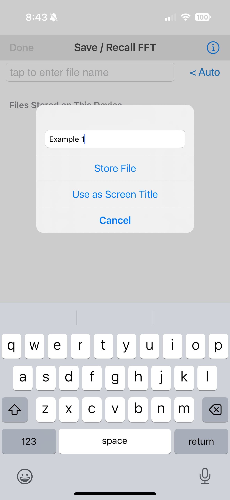
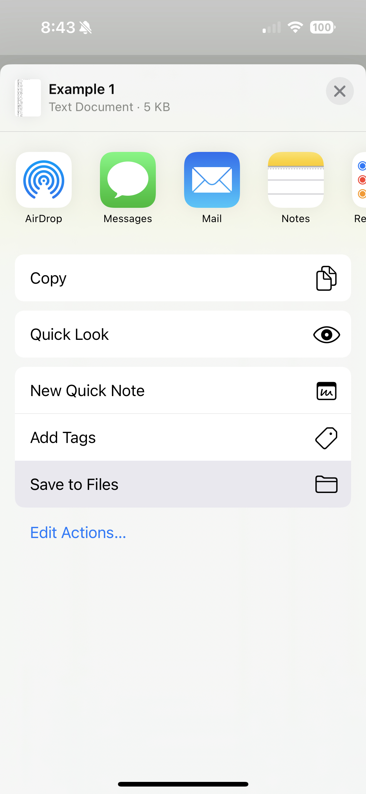